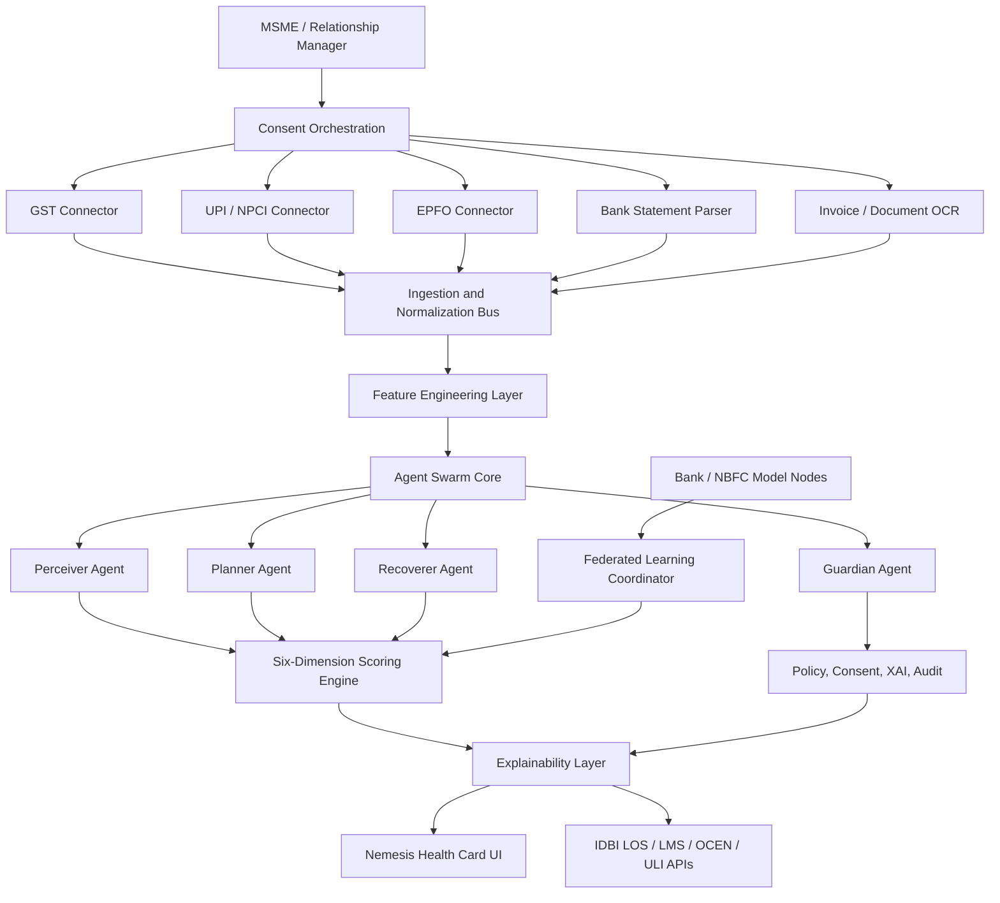
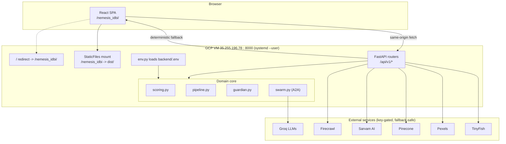
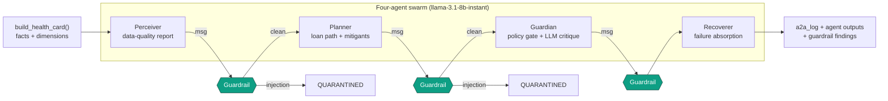
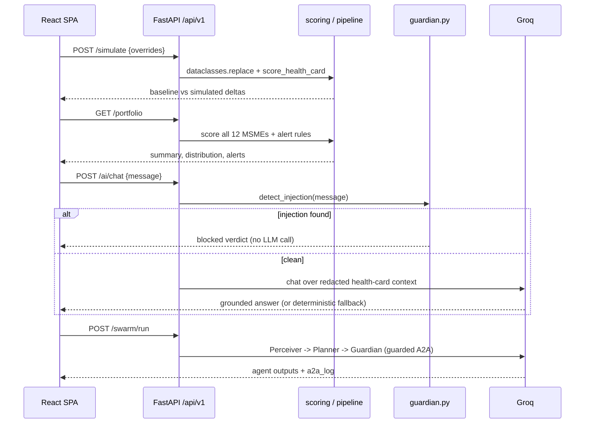
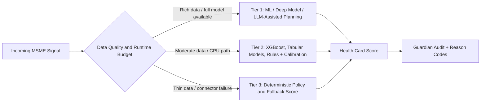
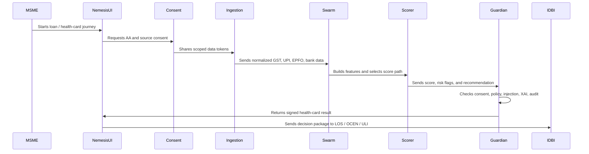
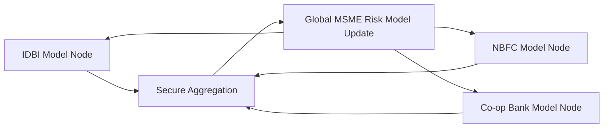

# Nemesis IDBI Hackathon

Nemesis is an MSME Financial Health Card and creditworthiness intelligence console built for the IDBI Innovate hackathon. It takes inspiration from the Eraya self-healing agent-swarm architecture and applies that pattern to alternate-data MSME lending.

The current repository contains a runnable full-stack prototype: a React + TypeScript operator console and a FastAPI backend that generates six-dimensional scores, reason codes, connector snapshots, Guardian policy findings, audit signatures, and federated-learning readiness metadata.

## One-Line Pitch

Nemesis converts AA-consented alternate data such as GST, UPI, EPFO, and bank-statement flows into an explainable MSME Financial Health Card, helping IDBI evaluate thin-file and new-to-credit businesses faster, safer, and with auditable reason codes.

## Live Deployment

The full prototype (React frontend + FastAPI backend, served from one process) is deployed at:

```text
http://35.255.196.78:8000/nemesis_idbi/
API docs: http://35.255.196.78:8000/docs
```

The frontend is served under the `/nemesis_idbi` base path so it can coexist with other apps on the host; the API stays at `/api/v1/*`. The backend runs as a `systemd --user` service (`nemesis.service`) with auto-restart. Requests to `/` redirect to `/nemesis_idbi/`.

## Problem Statement

Many MSMEs are creditworthy but remain under-served because traditional underwriting depends heavily on audited financials, ITR history, bureau depth, and manual document review. This creates four practical problems:

- Thin-file MSMEs can be rejected even when their real transaction behavior is healthy.
- GST, UPI, EPFO, bank, and invoice signals are fragmented across different systems.
- Decisioning takes days or weeks instead of minutes.
- Black-box scoring is difficult to justify in compliance, audit, and customer-facing workflows.

Nemesis addresses this by turning consented alternate data into a structured, explainable, and policy-checked health-card workflow.

## Solution Overview

Nemesis acts as an "enterprise mirror" for MSME lending:

- MSMEs see a transparent financial-health card instead of an opaque approval or rejection.
- IDBI sees hidden creditworthiness through alternate data and behavioral signals.
- Credit teams get reason codes, risk flags, scenario simulation, and audit trails.
- The system keeps working when some connectors are unavailable by using staged fallback logic.

## Current Prototype

The shipped prototype includes a frontend console plus a backend scoring API.

| Section | Purpose |
| --- | --- |
| Health Card | Shows the composite score, enterprise profile, loan request, six score dimensions, and cashflow trend; live sector imagery (Pexels) and one-click PDF export |
| Credit Model | Trained ML probability-of-default model (logistic scorecard + gradient boosting): PD, credit score, coefficient reason codes, ROC/calibration/gains (D3), business-impact uplift, model card, and a Hugging Face foundation model (all-MiniLM-L6-v2, 22M) for semantic peer benchmarking |
| What-If Lab | Interactive counterfactual simulator: six sliders recompute the score live (backend `/simulate` with an offline TypeScript scoring mirror) |
| Portfolio | Bank-side command center: 12-MSME book, score distribution, risk tiers, and an early-warning alerts queue with click-through |
| Swarm | Runs a real four-agent LLM swarm (Perceiver, Planner, Guardian, Recoverer) with a guarded agent-to-agent (A2A) message channel |
| Explainability | Shows reason codes, positive/negative score drivers, and counterfactual stress tests |
| Guardian | Demonstrates consent, policy, injection-defense, tamper-evident audit controls, and a recent decision-envelope trail |
| Federated | Shows a future multi-bank federated-learning view where model learning happens without raw data pooling |
| Architecture | Shows the consent, feature, swarm, scoring, and lending-rail workflow |
| API | Lists live backend endpoints and connector readiness |
| Integrations | Shows Groq, Firecrawl, TinyFish, Sarvam AI, Pinecone, Zerve AI, Pexels, OPA, SHAP, Great Expectations, Evidently, Qdrant/Chroma, OpenTelemetry, Presidio, Docling/Unstructured, MinIO, and LangGraph readiness |
| AI Credit Officer chat | Floating panel over every screen; Groq-powered answers over the live health card with Guardian injection screening on each message |

## Implemented Backend

The `backend/` folder now contains a FastAPI service with deterministic scoring and mock integrations.

| Module | What It Does |
| --- | --- |
| `backend/app/data.py` | Holds synthetic MSME records and scenario definitions |
| `backend/app/connectors.py` | Simulates AA, GSTN, UPI, EPFO, bank statement, OCEN, and ULI payloads |
| `backend/app/scoring.py` | Builds features, six score dimensions, composite score, reason codes, and benchmark metadata |
| `backend/app/guardian.py` | Performs policy checks, prompt-injection detection, and HMAC audit signing |
| `backend/app/integrations.py` | Optional AI, web verification, analytics, policy, monitoring, privacy, vector memory, document, storage, and workspace adapters |
| `backend/app/pipeline.py` | Orchestrates connectors, scoring, Guardian review, events, architecture, and federated status |
| `backend/app/main.py` | Exposes the FastAPI endpoints |

### API Endpoints

```text
GET  /api/v1/health
GET  /api/v1/enterprises
GET  /api/v1/health-card?enterprise_id=suryam&scenario=baseline
POST /api/v1/scenario/run
POST /api/v1/simulate                # What-If Lab: recompute score with overrides
GET  /api/v1/portfolio?scenario=baseline   # Portfolio command center
POST /api/v1/swarm/run               # Real LLM agent swarm with guarded A2A log
POST /api/v1/ai/chat                 # Guardian-screened AI credit officer chat
GET  /api/v1/ml/score?enterprise_id=suryam   # Trained PD model: score + reason codes
GET  /api/v1/ml/validation           # AUROC, KS, Gini, calibration, gains, PSI, impact
GET  /api/v1/ml/model-card           # Model governance card
GET  /api/v1/ml/peers?enterprise_id=suryam   # HF foundation-model semantic peers
GET  /api/v1/connectors/snapshot
GET  /api/v1/audit/latest
GET  /api/v1/federated/status
GET  /api/v1/architecture
GET  /api/v1/integrations/catalog
GET  /api/v1/integrations/summary
GET  /api/v1/ai/credit-memo
GET  /api/v1/verification/external
POST /api/v1/analytics/event
GET  /api/v1/policy/check
GET  /api/v1/model/monitor
GET  /api/v1/data-quality
GET  /api/v1/document-intelligence
GET  /api/v1/memory/status
GET  /api/v1/ops/status
GET  /api/v1/media/sector-image?sector=Auto+components   # Pexels imagery
POST /api/v1/privacy/redact
```

### Supported Scenarios

```text
baseline   Normal consented alternate-data scoring
thinData   Missing/partial connector data with Recoverer fallback
stress     Liquidity and concentration stress-test state
attack     Prompt-injection and unsafe override simulation
```

## Key Features

- Six-dimensional MSME score:
  - Cashflow Liquidity
  - Credit Discipline
  - Compliance Health
  - Concentration Risk
  - Growth Trajectory
  - Working Capital Efficiency
- Composite score with approve, review, and risk signaling.
- Alternate-data feature cards for GST, UPI, EPFO, and bank-statement coverage.
- SHAP-style reason-code surface for human-readable credit explanations.
- Scenario runner for baseline, thin-data, stress-test, and attack-simulation states.
- Guardian audit seal for policy-checked decisions.
- Agent-swarm architecture inspired by Eraya.
- Federated-learning concept for cross-bank model improvement without raw-data sharing.
- Optional AI credit memo through Groq with deterministic fallback.
- Optional external MSME verification through Firecrawl with fallback signals.
- TinyFish agentic-web and scoring event stream.
- Real four-agent LLM swarm with guarded agent-to-agent messaging.
- What-If Lab counterfactual simulator and portfolio command center.
- Guardian-screened AI credit officer chat.
- OPA-ready external policy evaluation with local rules fallback.
- Great Expectations-style data quality contracts.
- Evidently-style model monitor snapshot.
- Presidio-compatible PII redaction fallback.
- Qdrant/Chroma vector-memory readiness.
- MinIO document/export storage readiness.
- OpenTelemetry, Prometheus, Grafana, and Jaeger observability-ready services.
- Zerve and LangGraph workflow readiness.

## Advanced Tool Integrations

All advanced integrations are demo-safe. If the API key or service is present, Nemesis uses the live adapter. If it is absent, Nemesis returns a structured fallback response so the hackathon flow still works.

| Tool | Nemesis Use | Live Unlock |
| --- | --- | --- |
| Groq AI | AI credit officer chat, credit memo, and the four-agent LLM swarm (`llama-3.1-8b-instant` / `llama-3.3-70b-versatile`) | `GROQ_API_KEY` |
| Firecrawl | External web footprint and supplier/context verification | `FIRECRAWL_API_KEY` |
| TinyFish | Agentic web intelligence and real-time scoring/Guardian event stream | `TINYFISH_API_KEY`, `TINYFISH_EVENTS_URL` |
| Sarvam AI | Vernacular (Indian-language) credit-officer answers and borrower advice, voice-ready | `SARVAM_API_KEY` |
| Pinecone | Managed vector index for credit memos, policy docs, and decision templates | `PINECONE_API_KEY` |
| Zerve AI | Data-science workspace for feature experiments and model validation | `ZERVE_API_KEY` |
| Pexels | Live sector imagery for health cards and borrower-facing screens | `PEXELS_API_KEY` |
| Open Policy Agent | External Rego policy checks for consent and auto-approval | `OPA_URL` |
| SHAP | Future model-attribution upgrade for current reason codes | Python ML layer |
| Great Expectations | Connector and feature data-quality validation contracts | Local contracts |
| Evidently AI | Score drift, confidence drift, and monitoring reports | Local snapshot / future reports |
| Qdrant / Chroma | Self-hosted vector memory for credit memos, policy docs, profiles, templates | Docker or URLs |
| OpenTelemetry + Grafana | Agent and scoring observability | Docker Compose |
| Presidio | PII redaction before logs, prompts, and audit exports | Regex fallback now |
| Docling / Unstructured | Invoice, statement, GST, and purchase-order parsing | Contract stub now |
| MinIO | Object storage for documents and health-card exports | Docker Compose |
| LangGraph | Future graph orchestration for Perceiver -> Planner -> Guardian -> Recoverer | Design-ready |

All API keys are loaded from `backend/.env` (git-ignored) by a small stdlib loader (`backend/app/env.py`); existing environment variables always win.

## Architecture

Nemesis is designed as a layered system. The current repository implements the frontend prototype, while the architecture below describes the complete target solution.



## Advanced System Architecture

### Deployment Topology (as shipped)

A single FastAPI process serves both the static React bundle (under `/nemesis_idbi`) and the JSON API (under `/api/v1`). External AI/data services are called only when their key is present; otherwise every adapter returns a deterministic fallback.



### Guarded Agent-to-Agent (A2A) Swarm

Three of the four agents run on a small, fast LLM (`llama-3.1-8b-instant`); the Guardian adds a deterministic policy gate. **Every A2A message is screened before delivery** — prompt-injection scan, PII redaction, and a size cap — and a poisoned message is quarantined instead of reaching the next agent. The full annotated transcript is returned as `a2a_log`.



Guardrails applied on **each** hop: `detect_injection()` (quarantine on hit), `redact_pii()` (mask emails/phones/PAN/account patterns), and a `MAX_A2A_CHARS` truncation cap. A deterministic policy gate also checks score threshold, consent scopes, and whether any A2A message was blocked this run.

### Request Lifecycle Across the New Endpoints



## Architectural Layers

| Layer | Component | Responsibility |
| --- | --- | --- |
| L1 | Consent and ingestion | Pull AA-consented GST, UPI, EPFO, bank statement, invoice, and document data |
| L2 | Data normalization | Convert raw connector responses into stable MSME timelines and entity profiles |
| L3 | Feature engineering | Generate liquidity, compliance, concentration, growth, and working-capital features |
| L4 | Agent swarm | Coordinate perception, planning, policy checks, and fallback recovery |
| L5 | Scoring engine | Produce six-dimensional score plus composite creditworthiness score |
| L6 | Explainability | Convert model outputs into reason codes, score drivers, and counterfactuals |
| L7 | Delivery | Serve UI, APIs, audit records, LOS integration, OCEN, ULI, and AA workflows |
| L8 | Federated learning | Improve models across institutions without sharing raw customer data |

## Agent Swarm Design

Nemesis reuses the Eraya idea of a resilient four-agent swarm, adapted for banking and MSME underwriting. This is **implemented and live** in `backend/app/swarm.py` (`POST /api/v1/swarm/run`): Perceiver, Planner, and Guardian run on Groq's `llama-3.1-8b-instant`, and every agent-to-agent message passes a guardrail (injection scan, PII redaction, size cap) before the next agent sees it. If Groq is unreachable, each agent degrades to a deterministic response.

| Agent | Role in Nemesis | Example Output |
| --- | --- | --- |
| Perceiver Agent | Reads consented data, detects quality gaps, maps raw signals into structured features | "GST-bank reconciliation confidence: 96%" |
| Planner Agent | Selects scoring path, credit product, mitigants, and exposure recommendation | "Approve with buyer concentration cap" |
| Guardian Agent | Deterministic policy gate + LLM critique; enforces consent scope, explainability, and injection defense | "Blocked unsafe override; signed audit record" |
| Recoverer Agent | Keeps the workflow alive when an agent LLM call fails or data is partial | "Fallback to thin-file deterministic score" |

Guardrails on every A2A hop: `detect_injection()` quarantines poisoned messages, `redact_pii()` masks emails/phones/PAN/account numbers, and a `MAX_A2A_CHARS` cap prevents oversized payloads. The Swarm tab renders the resulting `a2a_log` with per-hop guardrail findings.

## Three-Tier Scoring Cascade

Nemesis is designed to avoid one-point failure in scoring. Each agent can degrade gracefully through three tiers.



Tier behavior:

- Tier 1: richer model path for complete data and advanced planning.
- Tier 2: reliable tabular scoring path for normal underwriting.
- Tier 3: deterministic fallback for thin-file or connector-failure scenarios.

## End-to-End Workflow



## Data Workflow

1. Consent capture: MSME authorizes scoped access through AA and source-specific connectors.
2. Data pull: GST, UPI, EPFO, bank, invoice, and document signals are fetched.
3. Entity resolution: Business identity, account, GSTIN, employer, and invoice entities are matched.
4. Normalization: Raw records are converted into monthly and transaction-level time series.
5. Feature generation: The current backend derives liquidity, discipline, compliance, concentration, growth, working-capital, and data-quality features.
6. Score calculation: The scoring cascade generates six dimension scores and a composite score.
7. Explainability: Score drivers are converted into human-readable reason codes.
8. Guardian review: Consent scope, policy rules, safety checks, and audit signing are applied.
9. Delivery: The Health Card appears in the UI and can be sent into IDBI systems through APIs.

## Six-Dimension Score Model

| Dimension | What It Measures | Example Signals |
| --- | --- | --- |
| Cashflow Liquidity | Ability to sustain cash inflows and absorb short-term shocks | UPI inflow volatility, bank balance trend, recurring credits |
| Credit Discipline | Repayment behavior and financial reliability | EMI delays, cheque returns, overdraft behavior |
| Compliance Health | Timeliness and consistency of formal reporting | GST filing regularity, GST-bank reconciliation, tax continuity |
| Concentration Risk | Dependence on a small set of buyers or suppliers | Top-buyer share, invoice HHI, customer churn |
| Growth Trajectory | Momentum and stability of business expansion | GST sales CAGR, transaction count growth, repeat-customer share |
| Working Capital Efficiency | Operating-cycle quality and capital usage | DSO, DPO, inventory cycle, invoice aging |

## Explainability and Reason Codes

Nemesis is designed so every score can be explained to both the lender and the MSME.

Example reason-code outputs:

- Positive: "GST filing regularity improved the compliance score because monthly returns were submitted on time for 12 months."
- Positive: "UPI settlement depth improved liquidity confidence because transaction count and receipt consistency are high."
- Negative: "Buyer concentration reduced the composite score because the top buyer contributes more than 40% of revenue."
- Negative: "Working-capital efficiency is under watch because invoice realization time increased in the last quarter."

## Guardian and Security Model

The Guardian layer is the policy and safety control plane.

| Control | Purpose |
| --- | --- |
| Consent scope enforcement | Prevents use of data outside the MSME-approved purpose |
| RBI-aligned explainability | Ensures every score has a reason-code trail |
| High-risk action gate | Blocks unsafe automated recommendations without review |
| Prompt-injection defense | Scans operator/model text for override or manipulation attempts |
| Tamper-evident audit | Signs important decision envelopes with an audit seal |
| Partial-data warning | Marks outputs where connector gaps reduce score confidence |

## Federated Learning Vision

Nemesis can support federated learning for consortium-scale model improvement:

- Raw MSME data stays within each participating institution.
- Local model nodes train on their own data.
- Only encrypted or aggregated model updates are shared.
- IDBI can benefit from broader learning without centralizing sensitive borrower data.



## Prototype UI Map

| UI Area | User Question It Answers |
| --- | --- |
| Composite score card | Is this MSME likely creditworthy? |
| Dimension radar | Which parts of the business are strong or weak? |
| Feature tiles | Which alternate-data sources are supporting the score? |
| Cashflow trend | Is liquidity improving, stable, or deteriorating? |
| What-If Lab | Which single lever most improves this MSME's score? |
| Portfolio | Where does the whole book sit, and which accounts need attention now? |
| Swarm view | Which agent made which part of the decision, and were the A2A messages safe? |
| AI Credit Officer chat | Can I just ask, in plain language, why this decision was made? |
| Explainability view | Why did the score move up or down? |
| Guardian view | Was the decision policy-checked and auditable? |
| Federated view | How can the model improve without raw-data pooling? |

## Repository Structure

The frontend is organized so each tab lives in its own feature directory under `src/features/`, with shared primitives in `src/components/` and pure logic in `src/lib/`.

```text
Nemesis_IDBI_hackathon/
|-- backend/
|   |-- app/
|   |   |-- connectors.py     # AA, GST, UPI, EPFO, OCEN, ULI mock connectors
|   |   |-- data.py           # 12 synthetic MSME records + scenarios
|   |   |-- scoring.py        # Feature engineering and six-dimension scoring
|   |   |-- guardian.py       # Policy checks, injection detection, HMAC audit signing
|   |   |-- pipeline.py       # End-to-end health-card orchestration
|   |   |-- simulation.py     # What-If Lab: dataclasses.replace + re-score
|   |   |-- portfolio.py      # Portfolio summary, distribution, alert rules
|   |   |-- ai_chat.py        # Guardian-screened credit-officer chat (Groq + fallback)
|   |   |-- swarm.py          # Four-agent LLM swarm with guarded A2A channel
|   |   |-- integrations.py   # Groq, Firecrawl, TinyFish, Sarvam, Pinecone, Zerve, Pexels, ...
|   |   |-- env.py            # Loads backend/.env without extra deps
|   |   `-- main.py           # FastAPI entrypoint + static frontend mount
|   |-- .env                  # Integration keys (git-ignored)
|   `-- requirements.txt
|-- src/
|   |-- features/             # One directory per tab
|   |   |-- health-card/      # HealthCardTab + PrintableHealthCard + print.css
|   |   |-- simulator/        # SimulatorTab (What-If Lab)
|   |   |-- portfolio/        # PortfolioTab (command center)
|   |   |-- swarm/            # SwarmTab (live A2A swarm)
|   |   |-- explainability/   # ExplainabilityTab
|   |   |-- guardian/         # GuardianTab
|   |   |-- federated/        # FederatedTab
|   |   |-- architecture/     # ArchitectureTab
|   |   |-- api/              # ApiTab
|   |   |-- integrations/     # IntegrationsTab
|   |   `-- chat/             # CreditOfficerChat (slide-over panel)
|   |-- components/
|   |   |-- layout/           # Sidebar, TopBar, nav-items
|   |   |-- charts/           # Radar, Sparkline
|   |   `-- ui/               # MotionCard, AnimatedNumber
|   |-- lib/
|   |   |-- nemesis-api.ts    # API client (same-origin aware, fallback behavior)
|   |   |-- scoring-local.ts  # TypeScript mirror of scoring.py for offline mode
|   |   |-- fallback-data.ts  # Static swarm/events/federated demo data
|   |   `-- format.ts         # Score tone, clamp, scenario helpers
|   |-- types.ts             # Shared TypeScript types
|   |-- theme.css            # Design tokens (CSS variables)
|   |-- App.tsx              # Shell: sidebar + topbar + tab router
|   |-- App.css              # Product dashboard styling
|   `-- main.tsx             # React entrypoint
|-- data/synthetic_msme_sample.csv
|-- ops/opa/underwriting.rego, ops/prometheus.yml
|-- index.html
|-- docker-compose.yml
|-- vite.config.ts           # base: '/nemesis_idbi/'
|-- package.json
`-- README.md
```

## Technology Stack

Current prototype:

- React 19 + TypeScript + Vite (base path `/nemesis_idbi/`)
- Framer Motion (tab transitions, animated score counters, spring chat panel)
- Recharts (portfolio distribution) + custom SVG radar/sparkline
- Sora + Inter typography over a CSS design-token theme
- FastAPI backend serving both the API and the built frontend from one process
- Deterministic six-dimension score engine, mirrored in TypeScript for offline mode
- Real four-agent LLM swarm (Groq `llama-3.1-8b-instant`) with guarded A2A messaging
- Guardian policy engine with injection detection and HMAC audit signing
- 12-MSME synthetic dataset, mock AA/GST/UPI/EPFO/OCEN/ULI payloads
- Live integrations: Groq, Firecrawl, Sarvam AI, Pinecone, Zerve AI, TinyFish, Pexels
- Docker Compose stack for backend, frontend, OPA, Qdrant, Chroma, MinIO, Prometheus, Grafana, and Jaeger

Target production stack:

- Frontend: React / Next.js
- Backend: FastAPI or Django REST
- Data processing: Python, pandas, Polars
- ML scoring: XGBoost, TabTransformer, scikit-learn
- Explainability: SHAP-style reason-code layer
- Federated learning: Flower or PySyft
- Security: HMAC audit signing, consent policy layer, injection scanning
- Integrations: AA, GSTN, NPCI UPI, EPFO, OCEN, ULI, IDBI LOS/LMS

## Run Locally

Install dependencies:

```powershell
npm install
```

Start the frontend:

```powershell
npm run dev
```

Open the Vite URL shown in the terminal. The default is usually:

```text
http://localhost:5173
```

Start the backend in a second terminal:

```powershell
cd backend
python -m venv .venv
.venv\Scripts\activate
pip install -r requirements.txt
uvicorn app.main:app --reload --host 127.0.0.1 --port 8000
```

The frontend automatically uses `http://127.0.0.1:8000` when running under the Vite dev server (port 5173); anywhere else it uses same-origin API calls. If the backend is off, the UI falls back to static demo data and the local scoring mirror.

## Build and Deploy (single-process)

Build the frontend and serve everything from FastAPI on one port:

```powershell
npm run build          # emits dist/ with base '/nemesis_idbi/'
cd backend
uvicorn app.main:app --host 0.0.0.0 --port 8000
```

Then open `http://<host>:8000/nemesis_idbi/`. FastAPI mounts `dist/` under `/nemesis_idbi` and redirects `/` to it; the API stays at `/api/v1/*`.

Redeploy to the demo VM after changes:

```powershell
npm run build
# package backend/ (app, requirements.txt, .env) + dist/, scp to the VM, extract into ~/nemesis
ssh -i ~/.ssh/evolet_rsa pardeep@35.255.196.78 "systemctl --user restart nemesis.service"
```

The VM runs Nemesis as a `systemd --user` service (`~/.config/systemd/user/nemesis.service`) with `Restart=on-failure`. Run `sudo loginctl enable-linger pardeep` once so the service also survives a reboot with no active login.

## Full Integrated Demo Stack

Copy environment placeholders:

```powershell
Copy-Item .env.example .env
```

Start the full stack:

```powershell
npm run compose:up
```

Services:

| Service | URL |
| --- | --- |
| Frontend | `http://localhost:5173` |
| Backend API | `http://localhost:8000/docs` |
| OPA | `http://localhost:8181` |
| Qdrant | `http://localhost:6333` |
| Chroma | `http://localhost:8001` |
| MinIO API | `http://localhost:9000` |
| MinIO Console | `http://localhost:9001` |
| Prometheus | `http://localhost:9090` |
| Grafana | `http://localhost:3001` |
| Jaeger | `http://localhost:16686` |

Stop the stack:

```powershell
npm run compose:down
```

## Build

```powershell
npm run build
```

## Lint

```powershell
npm run lint
```

## Backend Validation

```powershell
python -m compileall backend
```

## Hackathon Slide Mapping

Use this mapping for the IDBI prototype submission deck.

| Slide | Recommended Content |
| --- | --- |
| 1 | Team details, project name, problem statement |
| 2 | Brief idea and one-line pitch |
| 3 | Opportunity, differentiation, and USP |
| 4 | Feature list and product modules |
| 5 | End-to-end process flow |
| 6 | UI wireframes or screenshots |
| 7 | Architecture diagram |
| 8 | Technologies used |
| 9 | Estimated implementation cost |
| 10 | Prototype screenshots |
| 11 | Performance targets and benchmarking |
| 12 | Future development roadmap |
| 13 | GitHub, demo video, and product links |
| 14 | Security, compliance, and audit appendix |
| 15 | Closing / thank-you slide |

## Implementation Roadmap

| Phase | Deliverable |
| --- | --- |
| Week 1 | Synthetic MSME dataset, source schemas, consent-flow stub |
| Week 2 | Feature pipeline for GST, UPI, EPFO, and bank-statement signals |
| Week 3 | Baseline scoring model and six-dimension health-card output |
| Week 4 | Explainability layer, reason-code generation, and stress tests |
| Week 5 | Guardian policy engine, audit signing, and attack-simulation checks |
| Week 6 | IDBI sandbox integration, demo polish, deck, and video |

## Expected Impact

| Metric | Target |
| --- | --- |
| Indicative score time | Under 90 seconds |
| Full underwriting package | Under 24 hours after complete data availability |
| Reason-code coverage | 100% of generated decisions |
| Thin-file MSME support | Score using alternate data when bureau depth is low |
| Privacy posture | Federated-learning-ready, without raw cross-bank data pooling |

## GitHub

Repository:

```text
https://github.com/martian3062/Nemesis_IDBI_hackathon
```

## Status

This repository currently contains a polished frontend prototype plus a runnable FastAPI backend with mock connectors, deterministic scoring, reason codes, Guardian audit signing, architecture metadata, and federated-learning status. Real AA/GSTN/NPCI/EPFO production credentials, model training on institution data, and IDBI sandbox wiring remain future integration work.
